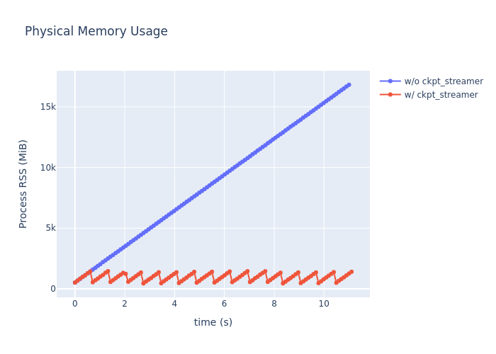

# Ckpt Streamer - Poor Man's Ckpt Stream Loader

**Ckpt Streamer** is a stream reader for PyTorch checkpoint files, designed for limited RAM people.

## Installation

Currently only works on POSIX-like system (Linux, macOS and WSL).

With `pip`:

```bash
$ pip install git+https://github.com/hnmr293/ckpt-streamer
```

With `uv`:

```bash
$ uv add git+https://github.com/hnmr293/ckpt-streamer
```

## Usage

Typical PyTorch ckpt loading with mmap is:

```python
import torch
model = torch.load('foo.ckpt', map_location='cpu', mmap=True)
state_dict = model['state_dict']
for key, val in state_dict.items():
    ...
```

With `ckpt_streamer`, replace `state_dict.items()` with `stream(state_dict)`:

```python
import torch
from ckpt_streamer import stream
model = torch.load('foo.ckpt')
state_dict = model['state_dict']
for obj, key, val in stream(state_dict, memory_limit_mb=1024):
    ...
```

In this case, physical memory usage of `state_dict` will **not exceed 1GiB**.

## Interface

```python
ckpt_streamer.stream(
    obj: Mapping[str, Any],
    memory_limit_mb: int = 1024,
    cpu_page_size: int = 4096,
) -> Iterator[tuple[Any, Any, torch.Tensor]]
```

The core API is the function `stream`. It yields tuples of `(obj, key, val)`, where `val` is ALWAYS a `torch.Tensor`, `obj` is the parent container of `val`, and `key` is the key in `obj` such that `obj[key] == val`.

Typically, `obj` is a `dict[str, torch.Tensor]`, and `key` is a `str`.

The order of yielded tensors follows the *backing storage* order, which differs from standard Python dictionary ordering.

## Performance

Test environment:
```
Platform: WSL2+Ubuntu22.04 on Windows11
CPU: Intel Core i7-13700
RAM: 64GB
```

### Physical Memory Usage

Tested with a 16GB ckpt file consisting of 1024 tensors, each containing 4,194,304 (4Mi) `float32` elements. For the `w/ ckpt_streamer` test, `memory_limit_mb` was set to `1024`. In each test, we iterate through all tensors, call `tensor.to(torch.bfloat16)`, and `time.sleep(0.01)` (for logging RSS).



### Access Speed

Tested with 4MB, 16MB, 64MB, 256MB, 1GB, 4GB, and 16GB ckpt files consisting of 1024 tensors. In each test, we iterate through all tensors and call `tensor.to(torch.bfloat16)`. Each test was repeated 100 times after 5 warm-up iterations. All tests were repeated 10 times with shuffling.


