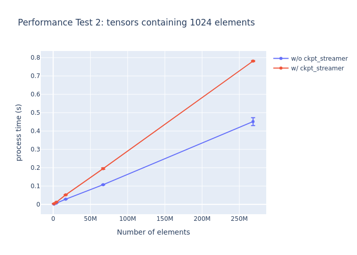

# Ckpt Streamer - Poor Man's Ckpt Stream Loader

**Ckpt Streamer** is a stream loader for PyTorch checkpoint files, designed for limited RAM people.


## Installation

Currently only works on POSIX-like system (Linux, macOS and WSL).

With `pip`:

```bash
$ pip install git+https://github.com/hnmr293/ckpt-streamer
```

With `uv`:

```bash
$ uv add git+https://github.com/hnmr293/ckpt-streamer
```

## Usage
Typically, PyTorch's `ckpt` file is loaded with `mmap = True` like this:

```python
import torch
model = torch.load('foo.ckpt', map_location='cpu', mmap=True)
state_dict = model['state_dict']
for key, val in state_dict.items():
    ...
```

With `ckpt_streamer`, replace `state_dict.items()` with `stream(state_dict)`:

```python
import torch
from ckpt_streamer import stream
model = torch.load('foo.ckpt')
state_dict = model['state_dict']
for obj, key, val in stream(state_dict, memory_limit_mb=1024):
    ...
```

In this case, physical memory usage of `state_dict` will **not exceed 1GiB**.

## Interfaces

### `stream()`: state_dict iterator

```python
ckpt_streamer.stream(
    state_dict: Mapping[str, Any],
    memory_limit_mb: int = 1024,
    cpu_page_size: int = 4096,
) -> Iterator[tuple[Any, Any, torch.Tensor]]
```

The core API is the function `stream`. It yields tuples of `(obj, key, val)`, where `val` is ALWAYS a `torch.Tensor`, `obj` is the parent container of `val`, and `key` is the key in `obj` such that `obj[key] == val`.

Parameters:
- `state_dict`: Your checkpoint dictionary. The `ckpt` file should be loaded with `mmap = True` and all tensors must be on the CPU.
- `memory_limit_mb`: The maximum amount of tensor data allowed to remain in physical memory, measured in MiB. For example, if you set `memory_limit_mb = 1024` (1GiB), tensor data will be automatically purged from physical memory when total usage exceeds this 1GiB limit.
- `cpu_page_size`: The system's memory page size in bytes. This should match your machine's actual page size (typically 4KiB = 4096 on most systems). Setting an incorrect value may cause OOM. You can verify your system's page size with `getconf PAGE_SIZE` on Linux/macOS.

Typically, `obj` is a `dict[str, torch.Tensor]`, and `key` is a `str`.

The order of yielded tensors follows the *backing storage* order, which differs from standard Python dictionary ordering.

### `apply_state_dict`: streaming fashion of `Module.load_state_dict`

```python
ckpt_streamer.apply_state_dict(
    model: torch.nn.Module,
    state_dict: dict[str, Any],
    converter: Callable[[torch.nn.Module, torch.nn.Module, torch.Tensor], torch.Tensor] = lambda root_module, current_module, x: x,
    strict: bool = True,
    assign: bool = False,
    memory_limit_mb: int = 1024,
    cpu_page_size: int = 4096,
) -> torch.nn.modules.module._IncompatibleKeys
```

`apply_state_dict` is a memory-efficient alternative to `model.load_state_dict()` that loads tensors in a streaming manner, ensuring that the memory usage does not exceed the specified limit.

Parameters:
- `model`: An instance of `torch.nn.Module`.
- `state_dict`: A checkpoint dictionary containing tensors.
- `converter`: A function to convert tensors. By default, it does not convert.
- `strict`: Whether to strictly enforce that the keys in `state_dict` match the keys returned by `model.state_dict()`. Default is `True`.
- `assign`: Whether to assign the tensor as a `torch.nn.Parameter`. Default is `False`.
- `memory_limit_mb`: Memory limit in MiB. Default is `1024`.
- `cpu_page_size`: System's memory page size in bytes. Default is `4096`.

Returns a `torch.nn.modules.module._IncompatibleKeys` object containing `missing_keys` and `unexpected_keys`.

## Performance

Test environment:
```
Platform: WSL2+Ubuntu22.04 on Windows11
CPU: Intel Core i7-13700
RAM: 64GB
```

### Physical Memory Usage

Tested with a 16GB ckpt file consisting of 1024 tensors, each containing 4,194,304 (4Mi) `float32` elements. For the `w/ ckpt_streamer` test, `memory_limit_mb` was set to `1024`. In each test, we iterate through all tensors, call `tensor.to(torch.bfloat16)`, and `time.sleep(0.01)` (for logging RSS).


### Access Speed

1. Tested with 4MB, 16MB, 64MB, 256MB, 1GB, 4GB, and 16GB ckpt files consisting of 1024 large tensors. In each test, we iterate through all tensors and call `tensor.to(torch.bfloat16)`. Each test was repeated 100 times after 5 warm-up iterations. All tests were repeated 10 times with shuffling. Error bars represent standard error.


2. Tested with 4MB, 16MB, 64MB, 256MB and 1GB ckpt files consisting of many tensors containing 1024 elements. In each test, we iterate through all tensors and call `tensor.to(torch.bfloat16)`. Each test was repeated 5 times after a warm-up iteration. Tests order is shuffled. Error bars represent standard error.


